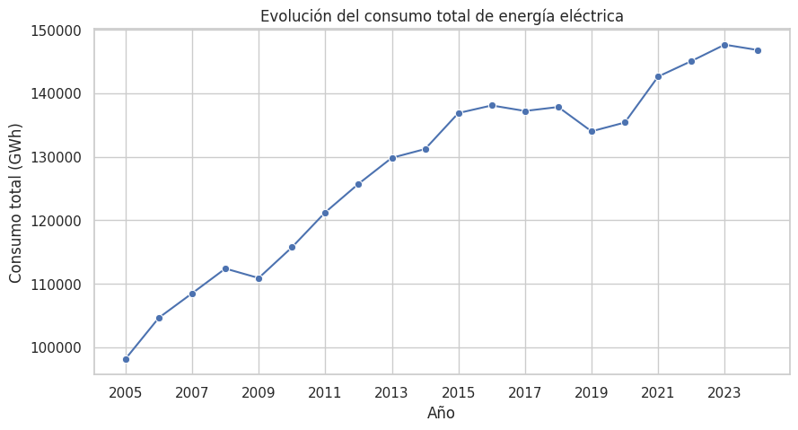
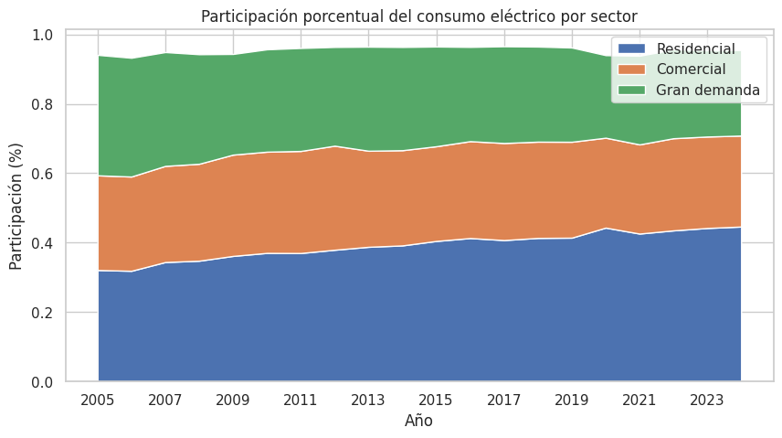
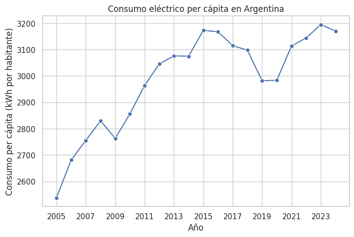
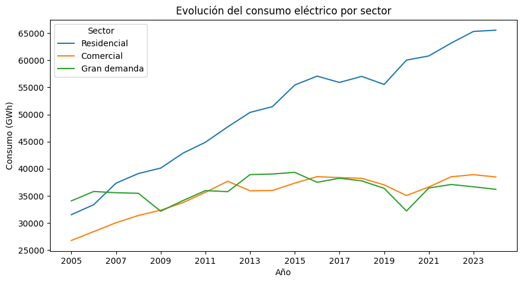
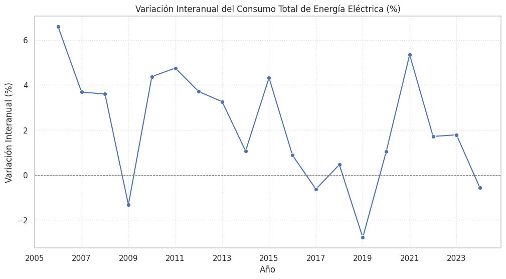
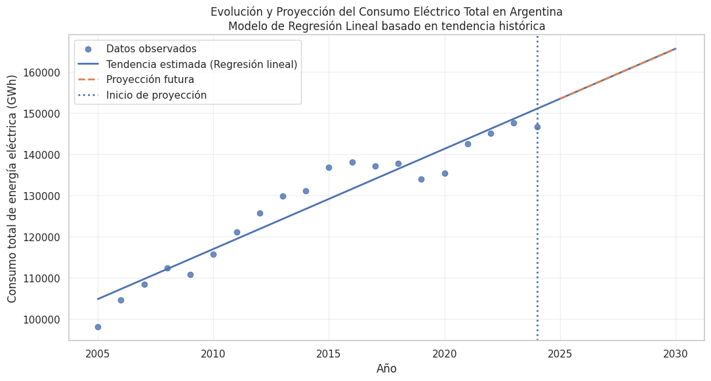

# 🔌 Análisis del Consumo de Energía Eléctrica en Argentina (2005–2024)


## 📋 Descripción
Análisis exploratorio (EDA) del consumo de energía eléctrica en Argentina entre 2005-2024, utilizando datos oficiales de CAMMESA e INDEC. Se estudian tendencias temporales, distribución por sectores y consumo per cápita.

## 🎯 Objetivos
- Analizar evolución temporal del consumo total
- Estudiar distribución por sectores (residencial, comercial, gran demanda)
- Calcular consumo eléctrico per cápita
- Identificar años con valores extremos
- Visualizar resultados de forma clara

## 📊 Datos
- **CAMMESA**: Consumo eléctrico por sector (GWh), 2005-2024
- **INDEC**: Población argentina, 2005-2024
- Datos procesados desde Excel a formato analizable

## 📈 Análisis Realizado
- Evolución temporal del consumo total
- Distribución porcentual por sectores
- Consumo per cápita anual
- Identificación de tendencias y valores extremos

## 📉📈 Hallazgos Principales
**Años bajos:** 2009 (crisis financiera) y 2020 (pandemia COVID-19)  
**Años altos:** 2017-2018 (reactivación económica) y 2022-2023 (recuperación post-pandémica)

**Conclusiones:**
1. Tendencia creciente a largo plazo
2. Mayor participación del sector residencial
3. Aumento del consumo per cápita
4. Los datos reflejan ciclos económicos y sociales

📊 Gráficos Principales
| Gráfico | Descripción | Visualización |
|---------|-------------|---------------|
| Consumo Total 2005-2024 | Evolución temporal del consumo |  |
| Distribución por Sectores | Participación porcentual anual |  |
| Consumo Per Cápita | Evolución del indicador demográfico |  |
| Comparativa Sectorial | Consumo absoluto por sector |  |
| Años Extremos | Identificación de valores atípicos |  |
| Predicción de consumo | Posible evolución mediante tendencia |  |

## 🛠️ Tecnologías
- Python 3.8+
- Pandas, NumPy
- Matplotlib
- Google Colab / Jupyter

## 🚀 Ejecución
```bash
git clone https://github.com/alejotrenti/consumo-energia-argentina.git
cd consumo-energia-argentina
```
Abrir `notebook/analisis_consumo_energia.ipynb` y ejecutar celdas en orden.

## 📂 Estructura
```
consumo-energia-argentina/
├── README.md
├── requirements.txt
├── notebook/
│   └── analisis_consumo_energia.ipynb
├── data/
│   ├── raw/
│        └── consumo_energia_fuente.xlsx
│   └── processed/
│        └── consumo_energia_limpio.xlsx
└── images/
    ├── consumo_total.png
    ├── sectores_porcentaje.png
    ├── consumo_per_capita.png
    ├── sectores_comparativa.png
    ├── prediccion.png
    └── anios_extremos.png
```

## 👤 Autor
**Alejo** - Estudiante de Ciencia de Datos - Argentina

---
